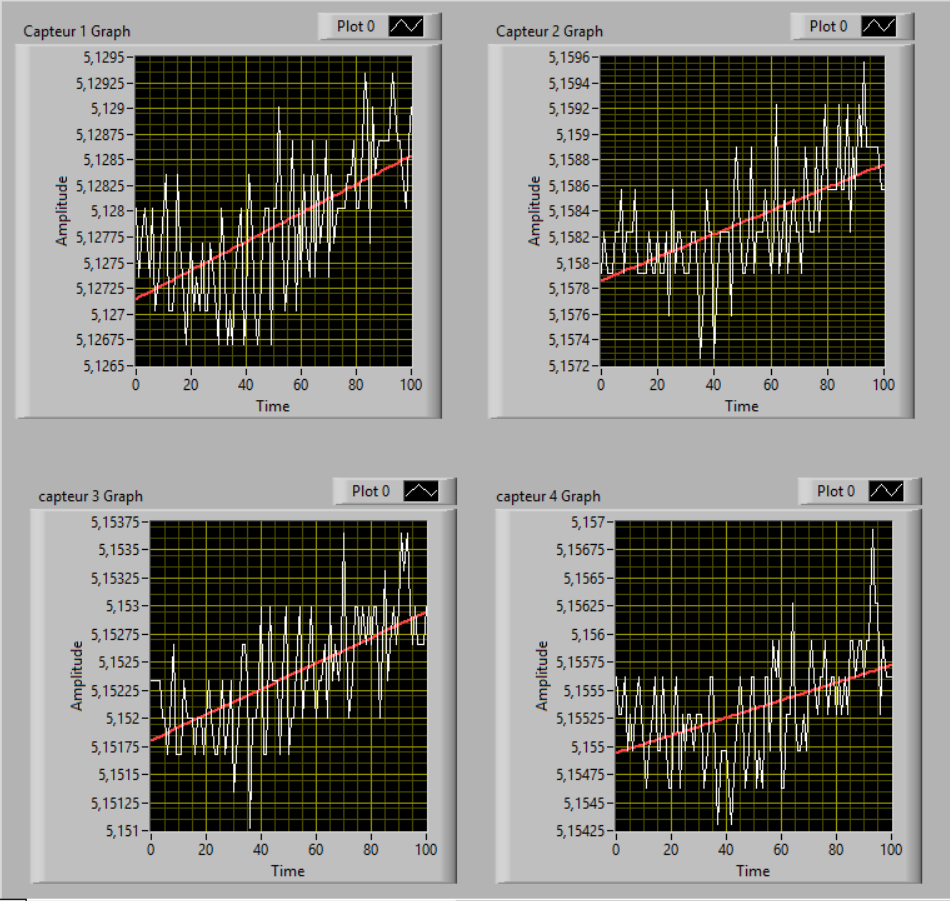

# Compute-Linear-Regression-with-LabView

This program is a part of a bigger one used to computer the displacement of the gravity center.
This one compute and draw the linear regression of data from 4 sensors.
The data was acquired by another LabView program and stored as <strong> ".tdms"</strong> files.
 
Some of the data are in the <strong>folder "Mesures"</strong>, you can use them to test the program.

 
<h2> The subVI read_data_from_tdms_file </h2>
This one is used to read data acquired.  
Entry : a path to the file  
Return : 4 clusters corresponding to the 4 sensors

 
<h2> The subVI ajustement_lineaire </h2>
Used to compute the linear regression from a cluster.  
Entry: A cluster (the one from the subVI read_data_from_tdms_file.  
Return: A array containing the best fit and the slope.

 
<h2> The VI compute_linear_regression </h2>
It is the main program. It is the one which displays the results
from data loaded.    

  

   

  

